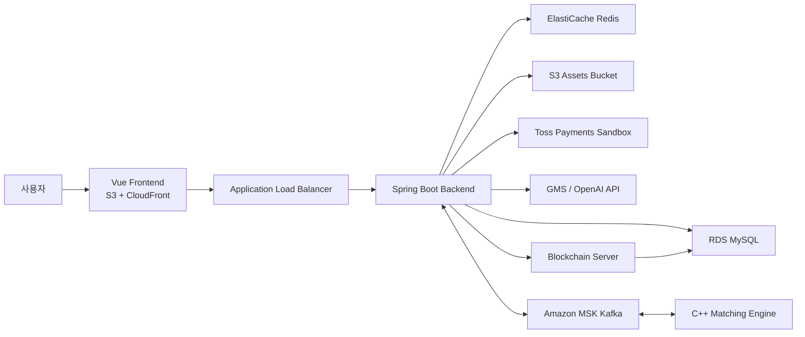
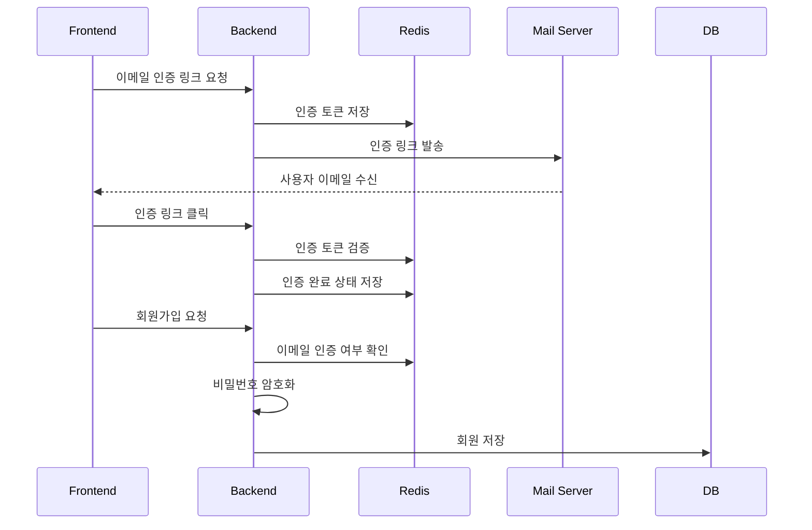
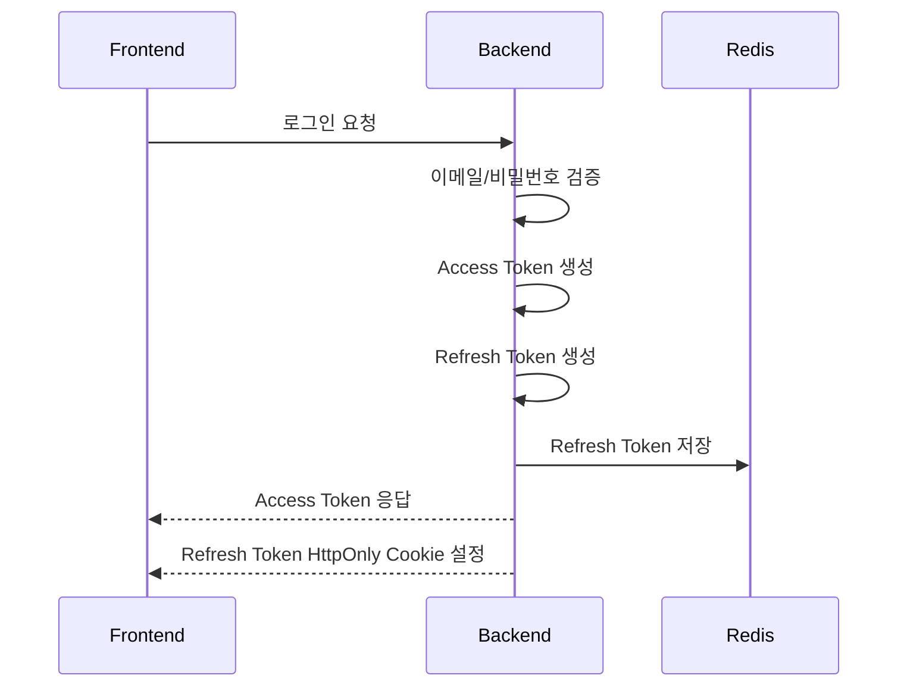
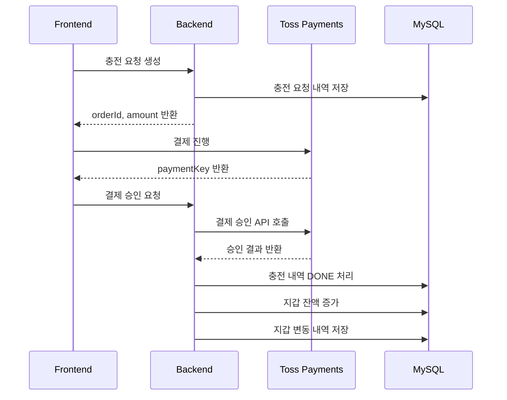
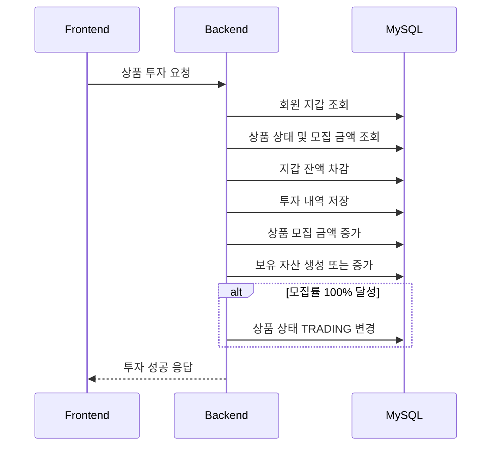
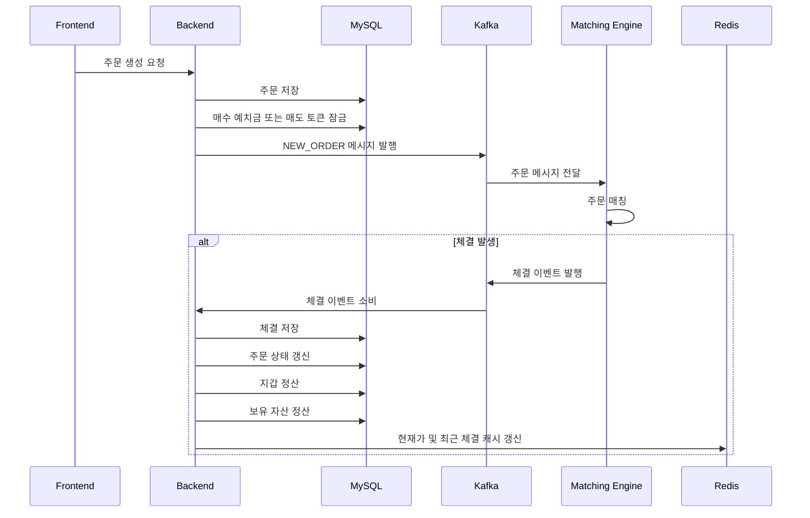
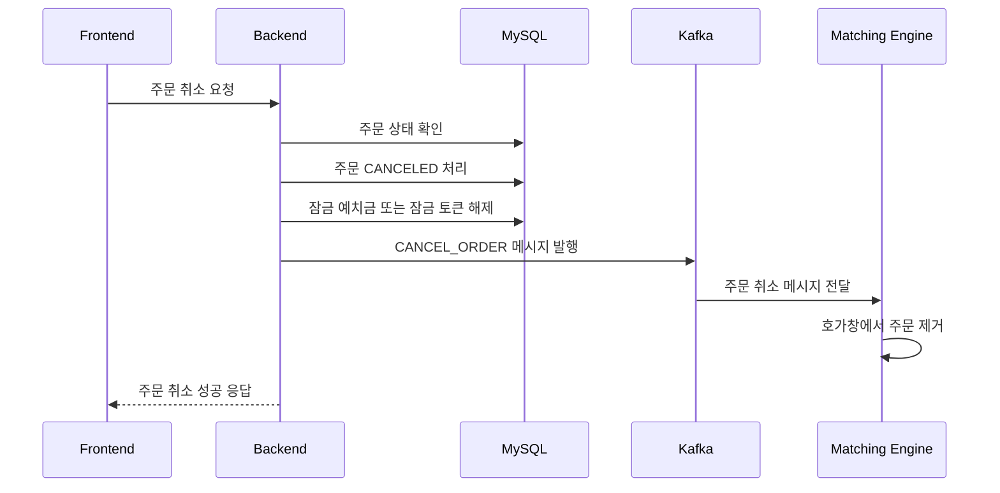
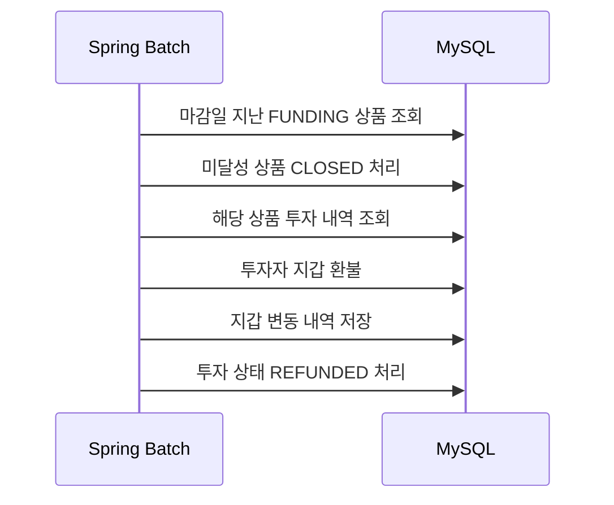
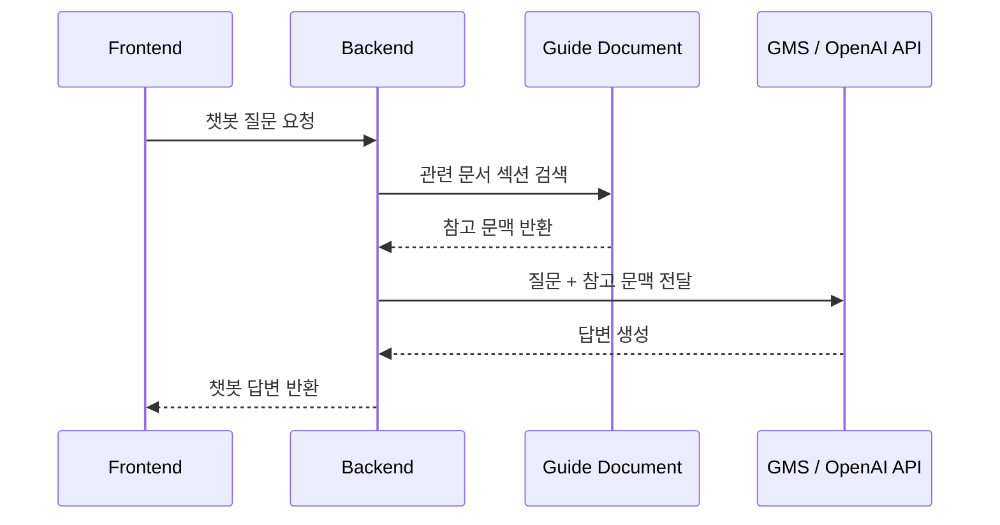
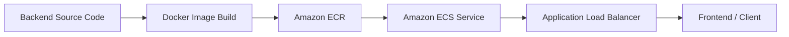

# PARTION BackEnd

> STO 기반 투자 및 거래 시뮬레이션 웹 서비스 Partion의 메인 백엔드 서버

PARTION BackEnd는 Partion 서비스의 핵심 비즈니스 로직을 담당하는 Spring Boot 기반 서버입니다.

회원 인증, 상품 관리, 예치금 충전, 투자, 주문, 체결 정산, 포트폴리오, 게시판, AI 챗봇, Batch 작업, 원장 서버 연동 등을 처리합니다.

---

## 프로젝트 개요

Partion은 STO(Security Token Offering) 기반 투자와 거래 흐름을 가상 환경에서 체험할 수 있는 웹 서비스입니다.

사용자는 예치금을 충전하고, 부동산·미술품·음악 저작권과 같은 실물 기반 STO 상품에 투자할 수 있습니다.

모집이 완료된 상품은 거래 가능 상태로 전환되며, 사용자는 거래소에서 해당 상품 토큰을 매수·매도할 수 있습니다.

PARTION BackEnd는 전체 서비스에서 다음 역할을 수행합니다.

- Frontend API 요청 처리
- 회원 인증 및 JWT 발급
- Refresh Token 및 로그아웃 처리
- 상품, 투자, 지갑, 결제, 주문, 체결, 포트폴리오 관리
- Kafka를 통한 Matching Engine 연동
- 체결 이벤트 기반 정산 처리
- Redis 기반 토큰 및 시세 캐시 관리
- Toss Payments Sandbox 결제 승인 처리
- S3 Presigned URL 발급
- Spring Batch 기반 상품 상태 및 환불 처리
- Spring AI 기반 서비스 안내 챗봇 제공
- Blockchain Server와의 원장 기록 연동

---

## 전체 서비스 내 Backend 위치



---

## 주요 기능

### 회원 및 인증

- 이메일 기반 회원가입
- 이메일 인증 링크 발송 및 검증
- 로그인
- 로그아웃
- Access Token 발급
- Refresh Token HttpOnly Cookie 발급
- Access Token 재발급
- Redis 기반 Refresh Token 저장
- Redis 기반 Access Token Blacklist 처리
- 비밀번호 재설정
- Google, Kakao, Naver OAuth 로그인

### 상품

- STO 상품 등록
- S3 Presigned URL 기반 상품 이미지 업로드
- 전체 상품 목록 조회
- 상품 상세 조회
- 내가 등록한 상품 조회
- 카테고리별 상품 조회
- 모집 상태별 상품 조회

### 예치금 및 결제

- 내 지갑 조회
- 예치금 변동 내역 조회
- Toss 결제 요청 생성
- Toss 결제 승인 확인
- 충전 내역 조회
- 지갑 잔액 증가 및 변동 내역 기록

### 투자

- 모집 중인 상품 목록 조회
- 모집 상품 상세 조회
- 상품 투자
- 투자 내역 조회
- 상품 모집 금액 증가
- 보유 자산 생성 및 증가
- 모집률 100% 달성 시 상품 상태 `TRADING` 전환

### 거래 및 주문

- 거래 가능 상품 목록 조회
- 매수 주문 생성
- 매도 주문 생성
- 주문 취소
- 내 주문 내역 조회
- 최근 체결 조회
- 호가창 조회
- 내 체결 내역 조회
- Kafka 기반 Matching Engine 주문 발행
- Kafka 체결 이벤트 소비
- 체결 이벤트 기반 DB 정산

### 포트폴리오

- 보유 자산 목록 조회
- 총 자산 요약 조회
- 보유 토큰 수량 조회
- Redis 현재가 기반 평가액 계산
- 예상 연 배당금 계산

### 게시판 및 댓글

- 게시글 작성
- 게시글 목록 조회
- 게시글 상세 조회
- 게시글 수정
- 게시글 삭제
- 댓글 작성
- 댓글 목록 조회
- 댓글 삭제

### AI 챗봇

- Spring AI 기반 서비스 안내 챗봇
- STO 개념 설명
- Partion 서비스 사용 방법 안내
- 투자와 거래 흐름 안내
- 내부 서비스 가이드 문서 기반 간단한 RAG 방식 적용

### Batch

- 마감일이 지난 모집 실패 상품 `CLOSED` 처리
- 모집 실패 상품 투자금 환불
- 투자 상태 환불 처리
- 지갑 잔액 복구
- 지갑 변동 내역 기록

### Ledger 연동

- 투자 및 거래 이벤트 원장 기록 요청
- 블록 목록 조회
- 블록 상세 조회
- 이벤트 목록 조회
- Blockchain Server와의 HTTP 연동

---

## 기술 스택

### Language & Framework

- Java 21
- Spring Boot
- Spring Security
- Spring MyBatis
- Spring Batch
- Spring AI

### Database & Cache

- MySQL
- Redis

### Messaging

- Kafka
- Amazon MSK

### Authentication

- JWT
- OAuth 2.0
- HttpOnly Cookie

### External API

- Toss Payments Sandbox
- GMS / OpenAI API
- AWS S3

### Infra

- AWS ECS
- AWS ECR
- AWS RDS
- AWS ElastiCache
- AWS MSK
- AWS S3
- AWS Secrets Manager
- Application Load Balancer
- Docker

---

## 주요 패키지 설명

| Package | Description |
| --- | --- |
| `global` | 공통 설정, 예외 처리, 보안, 유틸리티 |
| `auth` | 로그인, 로그아웃, 토큰 재발급, 이메일 인증, OAuth |
| `member` | 회원 정보 조회, 수정, 비밀번호 변경 |
| `wallet` | 지갑 조회, 예치금 변동 내역 조회 |
| `payment` | Toss Payments 결제 요청 및 승인 처리 |
| `product` | STO 상품 등록, 조회, 이미지 업로드 URL 발급 |
| `investment` | 모집 상품 투자, 투자 내역 조회 |
| `order` | 주문 생성, 주문 취소, 주문 내역 조회 |
| `trade` | 체결 내역, 최근 체결 조회 |
| `portfolio` | 보유 자산 및 총 자산 요약 |
| `board` | 게시글 CRUD |
| `comment` | 댓글 작성, 조회, 삭제 |
| `matching` | Kafka 기반 Matching Engine 연동 |
| `ledger` | Blockchain Server 원장 연동 |
| `ai` | Spring AI 기반 챗봇 |
| `batch` | Spring Batch 기반 자동 처리 작업 |

---

## 핵심 도메인 흐름

### 회원가입 및 이메일 인증 흐름



### 로그인 흐름



### 예치금 충전 흐름



### 투자 흐름



### 주문 생성 및 체결 흐름



### 주문 취소 흐름



### Batch 환불 흐름



### AI 챗봇 흐름



---

## 데이터베이스 구조

### 주요 테이블

| Table | Description |
| --- | --- |
| `members` | 회원 정보 |
| `wallets` | 회원별 지갑 현재 상태 |
| `wallet_transactions` | 예치금 변동 내역 |
| `deposit_histories` | Toss 결제 및 충전 내역 |
| `products` | STO 상품 정보 |
| `investments` | 모집 상품 투자 내역 |
| `holdings` | 회원별 보유 상품 토큰 |
| `orders` | 매수/매도 주문 |
| `trades` | 체결 내역 |
| `boards` | 게시글 |
| `comments` | 댓글 |
| `ledger_blocks` | 원장 블록 |
| `ledger_events` | 원장 이벤트 |

### 지갑 관련 테이블

- `wallets`는 현재 잔액 상태를 저장합니다.
- `wallet_transactions`는 잔액이 변경된 모든 사건을 기록합니다.
- 충전, 투자, 주문 잠금, 주문 취소, 체결 정산, 환불 등이 모두 지갑 변동 내역으로 남습니다.

### 주문 및 체결 관련 테이블

- `orders`는 사용자의 주문 요청과 현재 주문 상태를 저장합니다.
- `trades`는 실제로 매칭된 체결 결과를 저장합니다.
- 주문은 요청이고, 체결은 실제 거래 발생 결과입니다.

### 투자 및 보유 자산 관련 테이블

- `investments`는 모집 중 상품에 대한 1차 투자 내역입니다.
- `holdings`는 사용자가 현재 보유한 상품 토큰 수량입니다.
- 투자 성공 또는 거래 체결 시 `holdings`가 함께 갱신됩니다.

---

## Redis 사용 구조

Redis는 빠르게 조회하거나 만료 시간이 필요한 데이터를 저장하는 데 사용합니다.

| Key Pattern | Description |
| --- | --- |
| `refresh:{memberId}` | 회원 Refresh Token 저장 |
| `blacklist:{accessToken}` | 로그아웃된 Access Token Blacklist |
| `price:product:{productId}` | 상품 현재가 캐시 |
| `recent-trades:product:{productId}` | 상품 최근 체결 캐시 |

### Refresh Token

로그인 시 발급된 Refresh Token은 Redis에 저장됩니다.

Access Token이 만료되면 클라이언트는 HttpOnly Cookie에 저장된 Refresh Token을 이용해 Access Token 재발급을 요청합니다.

### Access Token Blacklist

로그아웃 시 기존 Access Token은 Redis Blacklist에 저장됩니다.

Blacklist에 등록된 Access Token으로 요청하면 인증이 거부됩니다.

### 현재가 캐시

체결 이벤트가 발생하면 해당 상품의 최신 체결 가격을 Redis에 저장합니다.

포트폴리오 평가액 계산이나 거래 화면 현재가 표시에서 활용됩니다.

---

## Kafka 메시지 구조

Backend와 Matching Engine은 Kafka를 통해 비동기 방식으로 통신합니다.

### Topic

| Topic | Direction | Description |
| --- | --- | --- |
| `partion.order.commands` | Backend → Matching Engine | 주문 생성 및 주문 취소 명령 |
| `partion.trade.events` | Matching Engine → Backend | 체결 이벤트 |

### 주문 생성 메시지

```json
{
  "commandType": "NEW_ORDER",
  "orderId": 1,
  "memberId": 10,
  "productId": 3,
  "side": "BUY",
  "price": 10000,
  "quantity": 5
}
```

### 주문 취소 메시지

```json
{
  "commandType": "CANCEL_ORDER",
  "orderId": 1,
  "memberId": 10,
  "productId": 3,
  "side": "BUY",
  "price": 10000,
  "quantity": 5
}
```

### 체결 이벤트 메시지

```json
{
  "eventId": "trade-event-id",
  "productId": 3,
  "buyOrderId": 1,
  "sellOrderId": 2,
  "price": 10000,
  "quantity": 5,
  "occurredAt": "2026-06-22T12:00:00"
}
```

---


## 로컬 실행 방법

### 1. MySQL 실행

로컬 MySQL 또는 RDS MySQL을 사용할 수 있습니다.

데이터베이스 이름은 기본적으로 다음과 같이 사용합니다.

```sql
CREATE DATABASE partion
DEFAULT CHARACTER SET utf8mb4
COLLATE utf8mb4_unicode_ci;
```

스키마는 다음 파일을 기준으로 생성합니다.

```text
src/main/resources/db/schema.sql
```

### 2. Redis 실행

Docker를 사용하는 경우 다음 명령어로 Redis를 실행할 수 있습니다.

```bash
docker run -d --name partion-redis -p 6379:6379 redis
```

Redis 실행 확인:

```bash
docker exec -it partion-redis redis-cli ping
```

정상 응답:

```text
PONG
```

### 3. Kafka 실행

Matching Engine과의 로컬 통합 테스트가 필요한 경우 Kafka를 실행해야 합니다.

프로젝트에서 사용하는 기본 Kafka 주소는 다음과 같습니다.

```text
localhost:9092
```

운영 환경에서는 Amazon MSK를 사용합니다.

### 4. application-local.properties 설정

로컬 환경에서는 다음 파일에 개인 설정을 작성합니다.

```text
src/main/resources/application-local.properties
```

민감 정보가 포함되므로 Git에 커밋하지 않습니다.

예시:

```properties
spring.datasource.url=jdbc:mysql://localhost:3306/partion?serverTimezone=Asia/Seoul&characterEncoding=UTF-8
spring.datasource.username=root
spring.datasource.password=your-password

spring.data.redis.host=localhost
spring.data.redis.port=6379

jwt.secret=your-jwt-secret
jwt.access-token-expiration=1800000
jwt.refresh-token-expiration=1209600000
```

### 5. 서버 실행

```bash
./mvnw spring-boot:run
```

Windows PowerShell:

```powershell
.\mvnw spring-boot:run
```

---

## 배포 구조

PARTION BackEnd는 Docker 이미지로 빌드한 뒤 ECR에 업로드하고, ECS에서 해당 이미지를 실행합니다.

### 배포 흐름



### 주요 AWS 리소스

| Resource | Usage |
| --- | --- |
| ECR | Backend Docker Image 저장 |
| ECS | Backend Container 실행 |
| ALB | 외부 요청을 ECS Backend로 라우팅 |
| RDS | MySQL 데이터베이스 |
| ElastiCache | Redis |
| MSK | Kafka |
| S3 | 상품 이미지 저장 |
| Secrets Manager | 운영 환경 Secret 관리 |

---

## API 문서

개발 환경에서 Swagger UI를 통해 API를 확인할 수 있습니다.

```text
http://localhost:8080/swagger-ui/index.html
```

주요 API 카테고리는 다음과 같습니다.

- Auth API
- Member API
- Product API
- Wallet API
- Payment API
- Investment API
- Order API
- Trade API
- Portfolio API
- Board API
- Comment API
- AI API
- Ledger API

---

## 보안 및 운영 참고 사항

### 민감 정보 관리

다음 값은 Git에 커밋하지 않습니다.

- DB 비밀번호
- JWT Secret
- Toss Secret Key
- AWS Access Key
- AWS Secret Key
- Mail Password
- AI API Key

운영 환경에서는 AWS Secrets Manager를 사용합니다.

### application-local.properties

`application-local.properties`는 로컬 개발용 설정 파일입니다.

개인 환경의 DB, Redis, API Key 등이 포함될 수 있으므로 Git 추적 대상에서 제외합니다.

### Batch 설정

운영 환경에서는 서버 시작 시 Batch Job이 자동 실행되지 않도록 다음 설정을 사용합니다.

```properties
spring.batch.job.enabled=false
spring.batch.jdbc.initialize-schema=never
```

Batch 메타 테이블은 운영 DB에 사전에 생성되어 있어야 합니다.

### Health Check

ECS와 ALB 배포 환경에서는 안정적인 상태 확인을 위해 별도의 Health Check API를 두는 것이 좋습니다.

예시:

```text
GET /health
```

---

## Summary

PARTION BackEnd는 Partion 서비스의 핵심 비즈니스 로직을 담당하는 Spring Boot 서버입니다.

이 서버는 단순한 REST API 서버를 넘어 다음 역할을 함께 수행합니다.

- 사용자 인증 및 권한 처리
- STO 상품 등록 및 조회
- 예치금 충전 및 지갑 관리
- 모집 상품 투자 처리
- Kafka 기반 주문 매칭 연동
- 체결 이벤트 기반 정산
- Redis 기반 토큰 및 시세 캐시 관리
- Spring Batch 기반 자동 상태 처리
- Spring AI 기반 서비스 안내 챗봇
- Blockchain Server와의 원장 기록 연동
- AWS 기반 배포 환경 연동

Partion의 Backend는 Frontend, Matching Engine, Blockchain Server, AWS 인프라를 연결하는 중심 서버입니다.
